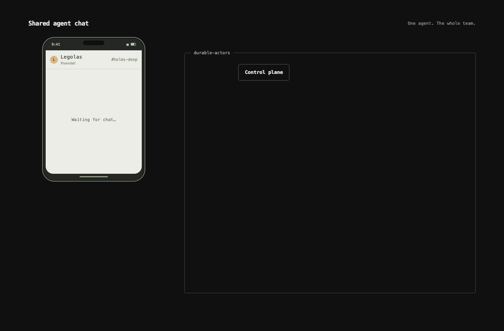

<div align="center">
  <a href="https://github.com/TerseAI/durable-actors/blob/main/.github/assets/team-agent.gif">
    <picture>
      <source media="(prefers-reduced-motion: reduce)" srcset=".github/assets/team-agent.png">
      
    </picture>
  </a>

  <h1>Durable Actors</h1>

  <p><strong>Durable state for collaborative apps and AI agents.</strong></p>
  <p>TypeScript actors. Rust runtime. Built by Terse.</p>

  <p>
    <a href="https://github.com/TerseAI/durable-actors/stargazers"></a>
    <a href="https://www.npmjs.com/package/durable-actors"></a>
    <a href="https://crates.io/crates/durable-actors"></a>
    <a href="https://github.com/TerseAI/durable-actors/actions/workflows/ci.yml"></a>
    <a href="https://github.com/TerseAI/durable-actors/blob/main/LICENSE.md"></a>
  </p>

  <p>
    <a href="#local-development"></a>
    <a href="https://github.com/TerseAI/durable-actors/tree/main/docs"></a>
    <a href="https://useterse.ai"></a>
    <a href="https://www.linkedin.com/company/terse-inc"></a>
  </p>

  <p>
    <a href="#local-development">Quickstart</a> ·
    <a href="https://github.com/TerseAI/durable-actors/blob/main/docs/reference/typescript.md">SDK</a> ·
    <a href="https://github.com/TerseAI/durable-actors/blob/main/docs/reference/openapi.md">HTTP API</a> ·
    <a href="https://github.com/TerseAI/durable-actors/tree/main/examples">Examples</a> ·
    <a href="https://github.com/TerseAI/durable-actors/blob/main/CONTRIBUTING.md">Contributing</a>
  </p>
</div>

---

> [!TIP]
> Get started by pasting this into your agent.
```text
Go to https://github.com/TerseAI/durable-actors, follow the readme and build a sample project. Get the development server running and ask the user where they would like to invoke their actors from.
```

Managing state is hard! Back in the pre-agent era, building a multiplayer app showed just how hard this could be. You had to lock resources, deal with websockets at scale, handle peak loads etc...

Now with AI, we've got agents working with agents and agents working with people to worry about. Furthermore, we have agent swarms coming!

Durable Actors is a primitive to help developers build the next generation of collaborative software. We provide a mechanism to serve shared, concurrency safe state to your app.

Based on the Actor principle from Erlang, all state is durably persisted for you. Only one Agent/person can be in the actor at a time, protecting you from race conditions.

We are fully serverless, and instances go dormant when not in use. Only pay for what your users are using.

We offer a clean API to manage webSocket connections, Swift inspired syntax for building your actor and full observability into your deployed actors.

Getting started is easy, build your actors, generate your type-safe client, test locally and deploy to prod.

## Local development

Install Node.js 22.19+, pnpm, and Bun 1.3.9+.

### Create your actor project in your directory of choice

```sh
npx durable-actors init my-actors
cd my-actors
pnpm install
# Or with npm:
npm install
npx durable-actors dev # Run the server locally on your machine
```

Running dev will also start a watch, every-time you make a change to an actor and save, metadata changes will be stored automatically.

### Connect your application

In your separate application project's directory (ex: node server), install the generator as a development dependency:

```sh
pnpm install --save-dev durable-actors
# Or with npm:
npm install --save-dev durable-actors
```

Then generate your client from the same application directory:

```sh
npx durable-actors generate
```

Now you may call your actor and access the state.

```ts
import { actors } from "./generated/index.js"

const counter = actors.Counter.get("example")
console.log(await counter.increment())
```

For complete sample applications, see [AI Chat](examples/ai-chat), [Collaborative documents](examples/documents), and [Chatroom](examples/chat).

## Define an Actor

Install `ai` in your actor project:

```sh
pnpm install ai
# Or with npm:
npm install ai
```

Define and export actors in your actor project’s `src/actors.ts`, the default entrypoint loaded by `durable-actors dev`. For example, a chat history actor:

```ts
import { openai } from "@ai-sdk/openai"
import { streamText } from "ai"
import { Actor, Persisted, type ActorSocket } from "durable-actors"

type Member = { name: string }
type Message = { role: "user" | "assistant"; content: string }
type Chat = { messages: Message[]; busy: boolean }

export class ChatHistory extends Actor<Member, string, Chat> {
    @Persisted messages: Message[] = []

    async onConnect(socket: ActorSocket<Member, Chat>) {
        socket.send({ messages: this.messages, busy: false })
    }

    @Reentrant
    async onMessage(socket: ActorSocket<Member, Chat>, text: string) {
        const messages: Message[] = [...this.messages, { role: "user", content: `${socket.metadata.name}: ${text}` }]
        this.broadcast({ messages, busy: true })

        const reply: Message = { role: "assistant", content: "" }
        const result = streamText({ model: openai("gpt-5-mini"), messages })
        for await (const chunk of result.textStream) {
            reply.content += chunk
            this.broadcast({ messages: [...messages, reply], busy: true })
        }

        this.messages = [...messages, reply]
        this.broadcast({ messages: this.messages, busy: false })
    }
}
```

## Stream from the backend (Express)

After adding `ChatHistory`, rerun `npx durable-actors generate` in your application and use its generated client:

```ts
import express from "express"

import { actors } from "../generated/index.js"

export const app = express()

app.post("/api/chat/:room/socket", async (req, res) => {
    const grant = await actors.ChatHistory.prepareWebsocket({
        actorId: req.params.room,
        metadata: { name: String(req.query.name ?? "Guest") }
    })
    res.set("Cache-Control", "no-store").json(grant)
})
```

## Connect the frontend (React)

```tsx
import { useEffect, useRef, useState } from "react"
import { createRoot } from "react-dom/client"

import type { actors } from "../generated/index.js"

const params = new URLSearchParams(location.search)
const room = params.get("chat") ?? "lobby"
const name = params.get("name") ?? "Guest"

function Chat() {
    const socket = useRef<WebSocket>(null)
    const [chat, setChat] = useState<actors.ChatHistory.Outgoing>({ messages: [], busy: true })

    useEffect(() => {
        let active = true
        async function connect() {
            const response = await fetch(`/api/chat/${encodeURIComponent(room)}/socket?name=${encodeURIComponent(name)}`, { method: "POST" })
            const { websocketUrl } = await response.json()
            if (!active) return
            socket.current = new WebSocket(websocketUrl)
            socket.current.onmessage = event => setChat(JSON.parse(event.data))
        }
        void connect()
        return () => {
            active = false
            socket.current?.close()
        }
    }, [])

    function send(form: FormData) {
        const text = String(form.get("message")).trim()
        if (!text || socket.current?.readyState !== WebSocket.OPEN) return
        socket.current.send(JSON.stringify(text))
        setChat(chat => ({ ...chat, busy: true }))
    }

    return (
        <main>
            <h1>AI chat · {room}</h1>
            <div role="log" aria-label="Messages">
                {chat.messages.map((message, index) => (
                    <article key={index}>
                        <strong>{message.role}</strong>
                        <p>{message.content}</p>
                    </article>
                ))}
            </div>
            <form action={send}>
                <input name="message" aria-label="Message" required disabled={chat.busy} />
                <button disabled={chat.busy}>Send</button>
            </form>
        </main>
    )
}

createRoot(document.getElementById("root")!).render(<Chat />)
```

## Community

Bug reports, feature requests, documentation fixes, and code contributions are welcome. See the [contributing guide](CONTRIBUTING.md) for repository setup and checks, and follow our [code of conduct](CODE_OF_CONDUCT.md).

Use [GitHub Issues](https://github.com/TerseAI/durable-actors/issues) for bugs, ideas, and questions. Report vulnerabilities privately using our [security policy](SECURITY.md).

Follow development and release notes on [GitHub Releases](https://github.com/TerseAI/durable-actors/releases).

## License

[MIT](LICENSE.md) © 2026 Terse
