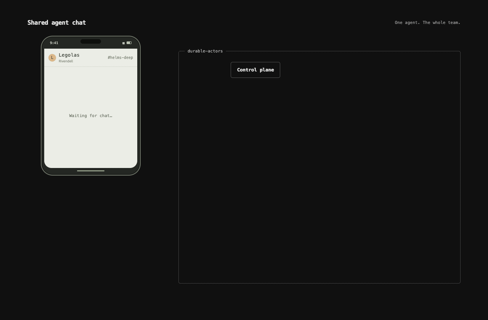

<div align="center">
  <h1 align="center">Durable Actors</h1>

  <p align="center"><strong>Durable state for collaborative apps and AI agents.</strong></p>
  <p align="center">TypeScript actors. Rust runtime.</p>

  <p align="center">
    <a href="https://github.com/TerseAI/durable-actors/stargazers"></a>
    <a href="https://www.npmjs.com/package/durable-actors"></a>
    <a href="https://crates.io/crates/durable-actors"></a>
    <a href="https://github.com/TerseAI/durable-actors/actions/workflows/ci.yml"></a>
    <a href="https://github.com/TerseAI/durable-actors/blob/main/LICENSE.md"></a>
  </p>

  <p align="center">
    <a href="#local-development"></a>
    <a href="https://github.com/TerseAI/durable-actors/tree/main/docs"></a>
    <a href="https://useterse.ai"></a>
    <a href="https://www.linkedin.com/company/terse-inc"></a>
  </p>

  <p align="center">
    <a href="#local-development">Quickstart</a> ·
    <a href="https://github.com/TerseAI/durable-actors/blob/main/docs/reference/typescript.md">SDK</a> ·
    <a href="https://github.com/TerseAI/durable-actors/blob/main/docs/reference/openapi.md">HTTP API</a> ·
    <a href="https://github.com/TerseAI/durable-actors/tree/main/examples">Examples</a> ·
    <a href="https://github.com/TerseAI/durable-actors/blob/main/CONTRIBUTING.md">Contributing</a>
  </p>
</div>

---

Durable Actors is an open-source TypeScript SDK and Rust runtime for building apps and AI agents that share persistent state.

### Start with a coding agent

Paste this prompt into your coding agent:

```text
Go to https://github.com/TerseAI/durable-actors, follow the README and build a sample project. Get the development server running and ask me where I would like to invoke my actors from.
```

Give each conversation, document, or agent a TypeScript actor: its saved state survives restarts, and its methods run one at a time by default so concurrent callers can update it safely.

The SDK provides actor classes, type-safe clients, and WebSocket support. The runtime loads actors on demand and persists fields marked `@Persisted`. Develop locally with one command, then self-host the runtime for production.

For example, a chat actor can keep a conversation across server restarts, or a document actor can coordinate edits from several people and agents without each caller managing database locks.

## Local development

Install Node.js 22.19+, pnpm, and Bun 1.3.9+.

### Create your actor project in your directory of choice

```sh
npx durable-actors init my-actors
cd my-actors
pnpm install
# Or with npm:
npm install
npx durable-actors dev # Run the server locally on your machine
```

## Define an Actor

Define and export actors in your actor project’s `src/actors.ts`, the default entrypoint loaded by `durable-actors dev`. For example, a chat history actor:

```ts
import { openai } from "@ai-sdk/openai"
import { streamText } from "ai"
import { Actor, Persisted, Reentrant, type ActorSocket } from "durable-actors"

type Member = { name: string }
type Message = { role: "user" | "assistant"; content: string }
type Chat = { messages: Message[]; busy: boolean }

export class ChatHistory extends Actor<Member, string, Chat> {
    @Persisted messages: Message[] = []

    async onConnect(socket: ActorSocket<Member, Chat>) {
        socket.send({ messages: this.messages, busy: false })
    }

    @Reentrant
    async onMessage(socket: ActorSocket<Member, Chat>, text: string) {
        const messages: Message[] = [...this.messages, { role: "user", content: `${socket.metadata.name}: ${text}` }]
        this.broadcast({ messages, busy: true })

        const reply: Message = { role: "assistant", content: "" }
        const result = streamText({ model: openai("gpt-5-mini"), messages })
        for await (const chunk of result.textStream) {
            reply.content += chunk
            this.broadcast({ messages: [...messages, reply], busy: true })
        }

        this.messages = [...messages, reply]
        this.broadcast({ messages: this.messages, busy: false })
    }
}
```


### Connect your Backend

We make it super easy to integrate the actors into your existing tech stack. Just generate the client and you get a fully type safe contract to interact with.

```sh
npx durable-actors generate
```

Now you may call your actor and access the state.

```ts
import express from "express"

import { actors } from "../generated/index.js"

export const app = express()

app.post("/api/chat/:room/socket", async (req, res) => {
    const grant = await actors.ChatHistory.prepareWebsocket({
        actorId: req.params.room,
        metadata: { name: String(req.query.name ?? "Guest") }
    })
    res.set("Cache-Control", "no-store").json(grant)
})
```

## Connect the frontend (React)

```tsx
import { useEffect, useRef, useState } from "react"
import { createRoot } from "react-dom/client"

import type { actors } from "../generated/index.js"

const params = new URLSearchParams(location.search)
const room = params.get("chat") ?? "lobby"
const name = params.get("name") ?? "Guest"

function Chat() {
    const socket = useRef<WebSocket>(null)
    const [chat, setChat] = useState<actors.ChatHistory.Outgoing>({ messages: [], busy: true })

    useEffect(() => {
        let active = true
        async function connect() {
            const response = await fetch(`/api/chat/${encodeURIComponent(room)}/socket?name=${encodeURIComponent(name)}`, { method: "POST" })
            const { websocketUrl } = await response.json()
            if (!active) return
            socket.current = new WebSocket(websocketUrl)
            socket.current.onmessage = event => setChat(JSON.parse(event.data))
        }
        void connect()
        return () => {
            active = false
            socket.current?.close()
        }
    }, [])

    function send(form: FormData) {
        const text = String(form.get("message")).trim()
        if (!text || socket.current?.readyState !== WebSocket.OPEN) return
        socket.current.send(JSON.stringify(text))
        setChat(chat => ({ ...chat, busy: true }))
    }

    return (
        <main>
            <h1>AI chat · {room}</h1>
            <div role="log" aria-label="Messages">
                {chat.messages.map((message, index) => (
                    <article key={index}>
                        <strong>{message.role}</strong>
                        <p>{message.content}</p>
                    </article>
                ))}
            </div>
            <form action={send}>
                <input name="message" aria-label="Message" required disabled={chat.busy} />
                <button disabled={chat.busy}>Send</button>
            </form>
        </main>
    )
}

createRoot(document.getElementById("root")!).render(<Chat />)
```

For complete sample applications, see [AI Chat](examples/ai-chat), [Collaborative documents](examples/documents), and [Chatroom](examples/chat).

Here's what it looks like in action:

<div align="left">
  <a href="https://github.com/TerseAI/durable-actors/blob/main/.github/assets/team-agent.gif">
    <picture>
      <source media="(prefers-reduced-motion: reduce)" srcset=".github/assets/team-agent.png">
      
    </picture>
  </a>
</div>

## Community

Bug reports, feature requests, documentation fixes, and code contributions are welcome. See the [contributing guide](CONTRIBUTING.md) for repository setup and checks, and follow our [code of conduct](CODE_OF_CONDUCT.md).

Use [GitHub Issues](https://github.com/TerseAI/durable-actors/issues) for bugs, ideas, and questions. Report vulnerabilities privately using our [security policy](SECURITY.md).

Follow development and release notes on [GitHub Releases](https://github.com/TerseAI/durable-actors/releases).

## License

[MIT](LICENSE.md) © 2026 Terse


## Production hosting

Deploy the [Helm chart](charts/terse/README.md) on GKE Sandbox. It runs the Rust control plane, shared HTTPS/WebSocket gateway and prewarmed Bun actor sandboxes in Kubernetes. Configurable storage replicas persist every write before acknowledgement and archive batches to Standard GCS every 16 MiB or 10 seconds. GCS retains ownership CAS and PostgreSQL handles registry and pool bookkeeping. The chart includes installation prerequisites, code deployment, capacity controls and rollout guidance.
