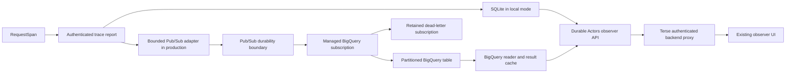

# Production analytics

Durable Actors owns telemetry export and both query providers. Terse integration remains Thomas's work. The existing observer UI and its response shapes stay unchanged.

## Runtime contract

`RequestSpan` assigns one event ID per attempt before reporting. `requestId` is correlation, not deduplication identity. Retries retain `eventId`; the local database and all warehouse queries deduplicate within project scope.

The control plane derives project, host, session, and region from the authenticated active host principal. A report containing an actor other than the principal's actor is rejected. Existing instrumentation is reused; socket application payloads, method arguments, and results are not exported. Connection metadata is exported only for explicitly allowed top-level keys.

The injected `TraceSink` is independent of the injected `TraceReader`. Local mode uses the existing SQLite store. Configuring analytics selects Pub/Sub publication and the BigQuery reader together; incomplete configuration fails startup, and query errors never fall back to an incomplete in-memory store.

The publisher has 1,024 outstanding-event slots, including events whose reporting connection has been cancelled. Google’s Pub/Sub client batches up to 64 events or 512 KiB with a 50 ms batching delay, and owns a retry policy of three attempts and two seconds. The reporting host retains its three-second report timeout and bounded best-effort queue. Actor execution never awaits this pipeline. Successful production reports wait for publication acknowledgement. The control plane attempts a five-second publisher drain after graceful HTTP shutdown.

**Durability begins at Pub/Sub acknowledgement.** Host/control-plane crashes before acknowledgement, full queues, invalid/expired timestamps, and expired host leases can lose telemetry. A report or publish timeout may have succeeded remotely. Existing host loss deltas and publication warnings are operational signals, not exactly-once loss accounting or a completeness watermark. There is no durable outbox or disk spool; host shutdown still has best-effort queue semantics.

## Storage and query parity

The Terraform module in `deploy/analytics` provisions a versioned event table, topic, native BigQuery export subscription, retained dead-letter subscription, table-scoped ingestion/read IAM, and backlog/dead-letter alerts. Pub/Sub messages use the table schema and preserve subscription metadata. JSON metadata is encoded as an escaped JSON string in the message, as required by table-schema subscriptions. [GCP JSON mapping](https://docs.cloud.google.com/pubsub/docs/create-bigquery-subscription)

The table partitions on `started_at`, requires partition filters, and clusters by project, actor name, actor ID, and connection ID. Defaults are 30 days of BigQuery partition retention and seven days of Pub/Sub recovery retention. Export rejects already expired UTC partitions and timestamps more than five minutes in the future. Runtime and Terraform retention settings must match.

BigQuery SQL first filters environment, project, schema version, and timestamp partitions, then deduplicates `(project_id, event_id)` by receipt/publication/message order. History, overview, queue-wait, and WebSocket queries all use that shared relation. BigQuery subscriptions deliver at least once; republishing must preserve the producer ID. [Delivery semantics](https://docs.cloud.google.com/pubsub/docs/bigquery)

| Query       | Semantics                                                                                                                               |
| ----------- | --------------------------------------------------------------------------------------------------------------------------------------- |
| Requests    | Inclusive time bounds; actor/outcome filters; newest first; pages of 1–500 records                                                      |
| Overview    | Count includes reroutes; success and exact nearest-rank p95 exclude rerouted attempts; empty denominators produce null                  |
| Queue waits | Only non-null waits on non-rerouted attempts; admitted count, average, maximum; same grouping/order and 500-row cap as SQLite           |
| WebSockets  | Aggregate the complete retained session before applying overlap filters; same connect/disconnect/message/failure fields and 500-row cap |

History pagination reads the original BigQuery job results. HMAC-signed cursors bind table, environment, project, filters, and page size to the job reference. They work across replicas using the same `DURABLE_ACTORS_SECRET`; expired cursors restart with `reset=true`. Rotating that secret invalidates existing cursors. BigQuery result retention and pagination requests remain subject to GCP availability.

The existing request SSE endpoint periodically sends `requests` events containing replacement snapshots (`reset=true`). This is a cached warehouse snapshot feed, not a second live ingestion pipeline. Existing UI clients already support replacement snapshots. Local SQLite retains its incremental SSE replay behavior. Production `sequence`/`cursor` values are result positions, not durable ingestion offsets. Warehouse responses set the local-only dropped/evicted counters to zero; publication failures are logged independently.

Inventory remains a runtime query. Project filtering happens before grouping, including inventory, local history, metrics, queue waits, and WebSocket sessions. Old SQLite records without a project remain visible only in the unscoped local administrative view.

## Backend boundary and caching

Use `/v1/projects/{project_id}/observe/{actors,events,requests,requests/events,metrics,queue-waits,websockets}` for hosted access. Routes require the runtime admin secret, just like the existing observer API. Terse must authorize its user/project before forwarding a request; the browser must never receive the runtime secret, Google credentials, SQL, or direct BigQuery access. Existing unscoped local routes remain available. BigQuery history reads require explicit project scope.

Thomas can point the existing observer client's base URL at a project-authorized backend proxy. DTOs, SSE event names, and query filter names are unchanged. No Terse or observer UI source changes are part of this work.

Every BigQuery job enables `useQueryCache`, disables legacy SQL, uses named parameters, and sets `maximumBytesBilled` plus a 20-second server job timeout. The client has a 25-second query deadline and attempts cancellation on failure; individual responses are capped at 8 MiB. Queries allow at most the configured retention duration and 16 in-flight jobs per backend process, including work continuing after an HTTP caller disconnects.

Each backend process keeps a 16 MiB result cache and coalesces identical misses. Its default TTL is 15 seconds (configurable 5–300 seconds). Open-ended upper bounds use the same time bucket; explicit absolute bounds remain exact. Cache keys include SQL version/text, environment, project, filters, time bounds, and page size. Errors are not cached. Browser responses remain `Cache-Control: no-store`.

This cache is per process, not Redis-backed or a global rate limiter. Size deployment replicas and GCP project quotas accordingly. Native BigQuery caching is best effort, especially with recent streaming writes; a hot streaming table can prevent cache hits even for historical partitions. [BigQuery cache conditions](https://docs.cloud.google.com/bigquery/docs/cached-results)

Start with 15-second cache buckets and measure ingestion visibility and billed query volume before reducing them. This adds no second event transport. A roughly 30–60 second visible freshness target is an expectation to validate, not a completeness or delivery guarantee. Sealed historical tables, shared cross-replica caching, BI Engine, and materialized views are follow-up optimizations based on measured cost.

## Validation and rollout

Local tests cover identity, project isolation, actor authorization, metadata/schema encoding, cancelled reports, publisher capacity/failure, cache coalescing, signed cursors across replicas, backend HTTP parameters/budgets, and the unchanged history/SSE envelope. Terraform tests use mocked providers and do not create resources.

The opt-in `pubsub_bigquery_end_to_end_matches_sqlite` test publishes duplicates and a second tenant into an isolated provisioned module, then compares BigQuery history/metrics/queue waits/session results with SQLite. Run it before rollout; local mocks do not validate GCP export behavior or GoogleSQL execution. See the deployment README for commands and recovery procedures.

The official Pub/Sub client version is pinned to the repository's Rust 1.89 support. The available official BigQuery REST crate requires Rust 1.90, so the query adapter uses existing `reqwest` and Google's ADC credential library at a narrow injected transport boundary. It implements only job submission, result pagination, and cancellation.
