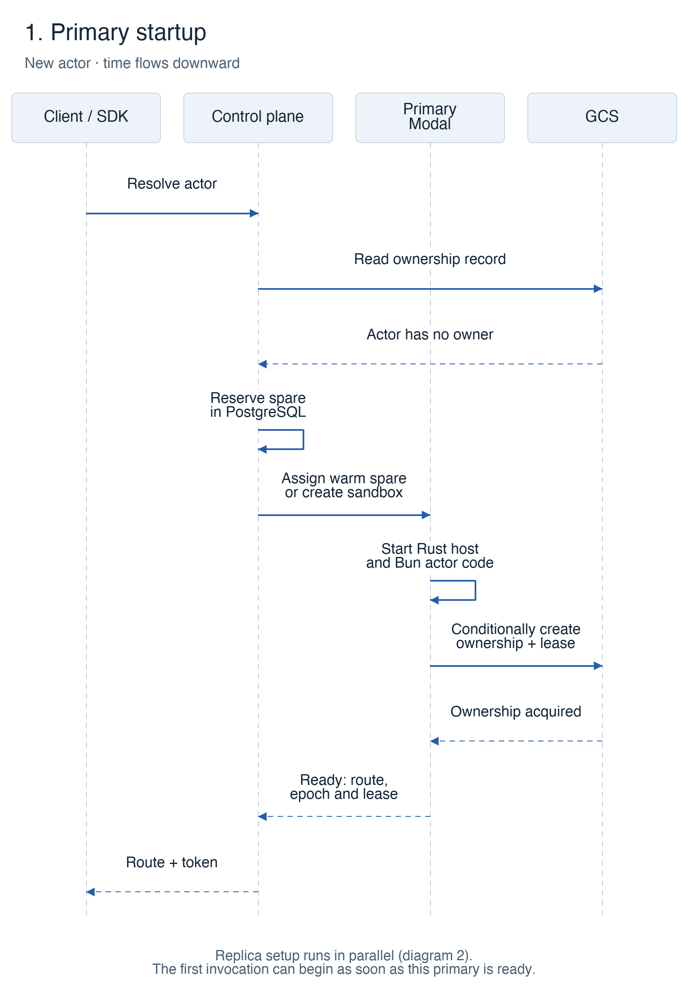
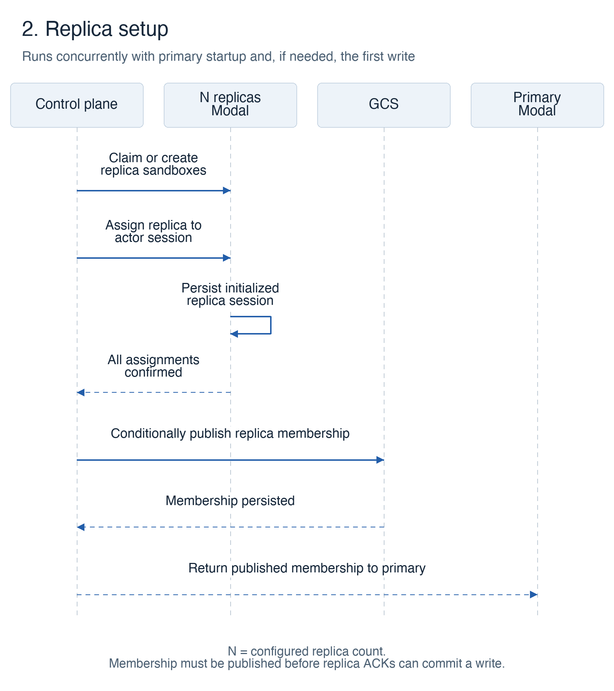
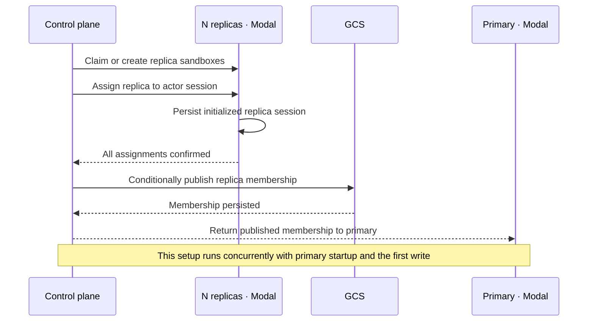
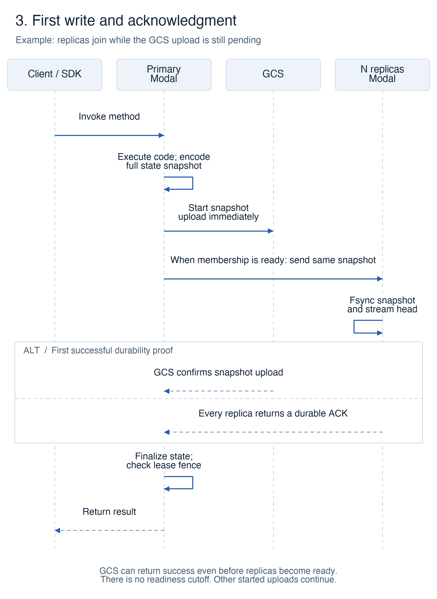
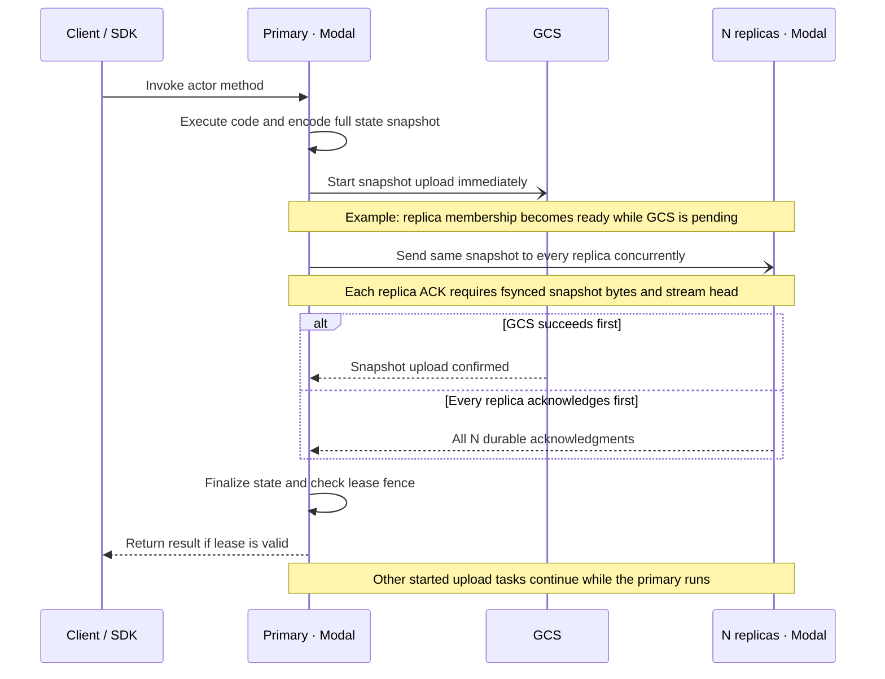

# Cold writes with GCS and Modal

These sequences show a new actor's first write with replication enabled. Primary startup and replica setup run concurrently. The client can invoke the actor as soon as the primary is ready; replica setup can finish before or during the first write. `N` is the configured replica count.

## Primary startup



<details>
<summary>Sequence source</summary>

```mermaid
sequenceDiagram
    participant C as Client / SDK
    participant CP as Control plane
    participant P as Primary · Modal
    participant G as GCS
    C->>CP: Resolve actor
    CP->>G: Read ownership record
    G-->>CP: Actor has no owner
    CP->>CP: Reserve spare in PostgreSQL
    CP->>P: Assign warm spare or create sandbox
    P->>P: Start Rust host and load Bun actor code
    P->>G: Conditionally create ownership and lease
    G-->>P: Ownership acquired
    P-->>CP: Ready: route, epoch and lease
    CP-->>C: Route and invocation token
    Note over C,G: Replica setup runs concurrently; primary readiness allows invocation
```

</details>

## Replica setup



“Assign replica to actor session” is one request. Its bearer token is checked locally by the replica; authentication adds no separate network round trip. Assignment binds an idle replica to this actor activation and initializes its storage session. The control plane publishes membership in GCS before the primary can use replica acknowledgments as a durability proof.

<details>
<summary>Sequence source</summary>



</details>

## First write and acknowledgment



This example shows replicas joining while the GCS upload is pending. The primary starts uploading immediately and sends the same snapshot to every replica once membership is ready. There is no five-second cutoff on waiting for initial readiness. Actual replica writes retain their separate five-second timeout.

The first successful GCS upload or complete set of replica acknowledgments establishes durability. The primary finalizes its cached state and checks its local lease fence before releasing the result. If GCS succeeds before replicas are ready, the write can return without waiting for them. Upload tasks that have already started continue while the primary runs.

<details>
<summary>Sequence source</summary>



</details>

For an existing dormant actor, recovery precedes the new ownership claim: the old lease must have expired, the old replica session is sealed, recoverable snapshots are checkpointed into GCS, and the latest state is loaded before a new epoch is claimed. See [bucket authority and replica snapshots](replication.md) for recovery and replica lifecycle details.
