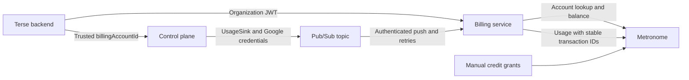

# Sandbox compute billing

The control plane meters sandbox allocation, GCP Pub/Sub delivers usage, and Metronome owns accounts, prices, credits, balances and usage history. Terse's billing service authenticates delivery, converts units and calls Metronome. It has no compute database or retry worker.

## Pricing and credits

| Resource | Unit | Compute USD |
| --- | --- | --- |
| Allocated CPU | vCPU-hour | 0.070956 |
| Allocated memory | GiB-hour | 0.024012 |
| Sandbox uptime | Seconds | Reporting only |

One Compute USD equals one US dollar. Metronome metrics sum vCPU-seconds and GiB-seconds; product quantity conversion divides by 3,600. A 2-vCPU, 8-GiB sandbox running for one hour costs 0.334008 Compute USD. An initial grant of 10 leaves 9.665992.

Operators grant credits manually in Metronome, restricted to the customer's compute contract and CPU/memory products. There is no compute top-up, subscription or recurring grant. The configured credit type is `2534e030-aa9b-4dd1-b6c3-8a2ed0dbe99a`, and the `sandbox-standard` rate card is `a88c695d-c7af-43da-9e6d-3793ee5066f4`. Verify these belong to the selected Metronome environment.

## Account attribution

Terse resolves the project's organization from its existing application database. Its organization-authenticated request to `POST /billing/compute/account` ensures a Metronome customer with alias `compute:<organizationId>` and a contract keyed `compute-v1:<organizationId>`. The response is the customer's UUID, passed as `billingAccountId` in the authenticated control-plane deployment request.

The runtime persists that identity with the deployment, includes it in the host configuration identity and copies it into the immutable sandbox usage assignment. Compilation and secret rotation preserve it. A later redeployment cannot reattribute an earlier session's delayed events. Client-supplied organization IDs or customer IDs are not accepted as billing authority by Terse.

## Measurement and publication

Billing begins after successful activation, when the runtime is ready and its provider identity and allocation are known. Idle prewarmed spares and failed activations are not billed. The control plane observes the assigned pod UID and runtime container every ten seconds. Confirmed termination supplies the last interval endpoint; a missing pod stops at its last confirmed observation. Unobserved pod tails can therefore be undercounted.

PostgreSQL keeps one measurement row per session: immutable assignment, latest observed timestamp, published checkpoint and stopped state. It does not queue new usage events. The checkpoint and observed timestamp survive controller restarts and pod cleanup.

The publisher derives intervals at fixed ten-second UTC boundaries, plus an exact final partial interval for stopped sessions. IDs are `sandbox_usage_v1:<sessionId>:<startMs>:<endMs>`. It advances the published checkpoint only after Pub/Sub confirms all messages. A crash between publication and checkpointing regenerates identical intervals even if observation has advanced. Concurrent publishers can produce duplicate messages, but their billing transaction IDs remain identical. No message ordering guarantee is required.

`UsageSink` is a constructor-injected hook. `PubSubUsageSink` publishes one base64-encoded JSON interval per message using application-default Google credentials. The authenticated HTTPS sink remains available for other consumers. Configure one destination at a time.

Migration V17 is additive. It preserves the earlier migration and any existing usage data; earlier outbox records are drained unchanged, while all new observations use checkpoints. Stop old metering workers before upgrading an enabled prototype, since old and new publishers must not overlap. Sessions created before billing identity propagation need operator reconciliation; never guess their billing customer.

## Pub/Sub and Metronome

A wrapped push subscription calls `POST /billing/compute/pubsub`. The service validates Google's JWT signature, issuer, audience, expiry and the configured verified service-account email, then validates and forwards the interval. It returns 204 only after Metronome ingestion succeeds. Pub/Sub owns retry timing, retention and dead-letter delivery.

The consumer preserves transaction IDs and interval timestamps, converts integer milliseconds/millicores/MiB to exact decimal usage quantities and submits them to the recorded customer. There is no intermediate account mapping, credit balance copy or usage ledger. Older-than-33-day events are rejected for reconciliation to stay within Metronome's automatic replay horizon.

Shadow mode forwards `sandbox_usage_shadow_v1` to Metronome. Priced metrics must filter exactly `sandbox_usage_v1`. Enabling charging requires an explicit cutoff; intervals beginning before it remain shadow. Keep that cutoff stable and never move it backward to bill historical shadow data. Disabling charging converts later deliveries to shadow, including backlog; pause Pub/Sub delivery instead when preserving classification is required.

Optional `UsageAuthorizer` checks ask the billing service for the account's current Metronome balance before starting a sandbox. This is admission control, not a hard spending cap: running sandboxes continue and can overdraw. Actual CPU/memory utilization, automated termination, reservations and non-GKE lifecycle reconciliation are follow-up work.

## Rollout

Deploy this runtime with metering disabled first so its deployment API accepts `billingAccountId`. Deploy the billing service and Terse, redeploy pilot actors to persist their billing account UUID, create the Pub/Sub topic and authenticated subscription, then enable runtime publication in shadow mode. Grant pilot credits manually before enabling charging. The billing-service README in TerseAI/terse-commercial contains the GCP IAM commands, dead-letter setup, environment settings and rollout procedure. Runtime Helm settings are in [the chart README](../../charts/terse/README.md#sandbox-usage).

Validate real GKE observations, Google publishing/push permissions, Metronome event classification and the one-hour drawdown before production charging. Local regression tests cover restart/retry identities, concurrent checkpoint acknowledgments, final tails, trusted attribution, publisher confirmations, signed push authentication, Metronome failures and credit-based admission. The earlier synthetic pricing result is not a live GKE integration test or runtime configuration artifact.
