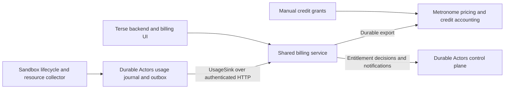

# Sandbox usage and shared billing plan

> Initial PR scope: GKE allocation metering with a durable journal/outbox; a separate Compute USD wallet and durable billing inbox; manual Metronome credit grants; Terse project binding and billing UI; optional admission checks. Shadow traffic is never promoted to billable traffic. Actual utilization collection, automatic stopping/draining at exhaustion, reservations for a hard spending cap, and provider-wide reconciliation are follow-up work. The implementation may undercount unobserved pod tails and does not claim to complete every phase below.


Implementation plan, September 29, 2026. Planning branch: `codex/sandbox-billing`, based on `origin/main` at `49da720`. The supplied Metronome verification setup passed a synthetic usage and credit-drawdown check; runtime metering and billing-service integration are still to be implemented.

Build reliable sandbox metering in Durable Actors and extend the existing `terse-commercial/billing-service` to accept it. Keep resource measurements in Durable Actors, pricing and credit policy in the billing service, financial accounting and manual credit grants in Metronome. Terse remains a client of the same billing service.

The first release should charge for allocated CPU and memory over sandbox uptime, collect actual consumption alongside those quantities, and run in shadow mode before enabling charges. This fits the current GKE provider, which sets resource requests equal to limits. The intended later model supports Modal-style charging for the higher of requested and actual resources when bursting is available.

## Compute balance

Credits are granted manually in Metronome for this rollout. Compute checkout, subscription plans, recurring grants, and payment automation are outside scope. The usage contract is still required to rate CPU and memory consumption.

Use **1 Compute USD granted = $1 of compute balance**. Metronome tracks this through the dedicated **Compute USD** credit type: one unit represents one US dollar. Display customer balances and usage costs in dollars. A manual grant of 10 Compute USD adds $10 of compute balance; there is no separate credit-pack conversion for sandbox compute.

Use the **Sandbox Standard** rate card, alias `sandbox-standard`, for CPU and memory. These products consume the compute balance. Terse's existing agent/LLM balance stays separately scoped within the shared billing service. Any future consolidation of balances requires an explicit migration.

Events carry resource-seconds. Each Metronome usage product divides its metric quantity by 3,600 and applies an hourly rate, without quantity rounding. The exporter must send seconds and leave that conversion to Metronome.

## Proposed pricing and billing rules

Modal currently lists these Sandbox and Notebook rates, verified September 29, 2026. Hourly figures are calculated from the published per-second prices. These are the proposed initial sandbox rates. [Modal pricing](https://modal.com/pricing)

| Resource | USD per second | USD per hour |
| --- | ---: | ---: |
| One Modal physical core, equivalent to two vCPUs | 0.00003942 | 0.141912 |
| One vCPU, using the proposed two-to-one conversion | 0.00001971 | 0.070956 |
| One GiB memory | 0.00000667 | 0.024012 |

Modal bills Sandboxes each second using the higher of the resource request or actual consumption. Its CPU configuration uses physical cores, and memory uses MiB. [Modal sandbox resource model](https://modal.com/docs/guide/sandbox-resources)

Our current `cpu` setting becomes Kubernetes millicpu directly. Keep that API meaning and explicitly document its units. Kubernetes CPU units depend on the underlying machine; for supported GKE VM pools, validate the vCPU mapping and adopt the vCPU rate above as a pricing convention. Do not describe the conversion as a guarantee of dedicated physical cores. [Kubernetes resource units](https://kubernetes.io/docs/concepts/configuration/manage-resources-containers/)

For the first release:

```text
cpu_vcpu_seconds = allocated_cpu_millis / 1000 × billable_seconds
memory_gib_seconds = allocated_memory_mib / 1024 × billable_seconds
cost_usd = cpu_vcpu_seconds × 0.00001971
         + memory_gib_seconds × 0.00000667
```

Examples at these proposed rates: the current default allocation of 250m CPU and 256 MiB costs $0.023742/hour; one vCPU and one GiB costs $0.094968/hour; two vCPUs and eight GiB cost $0.334008/hour. Actual utilization does not reduce the reserved-resource charge.

Track `sandbox_seconds` as its own meter for reporting. The initial price is composed of CPU time and memory time; there is no additional flat sandbox-time charge. Preserve subsecond duration and fractional credits, aggregate with decimal arithmetic, and round currency at settlement. These are our proposed rounding rules, not a claim about Modal's internal implementation. Retain current resource minimums; adopting Modal's exact minimum allocation is a separate product change.

| Lifecycle situation | Proposed customer charge |
| --- | --- |
| Assigned sandbox becomes ready for customer execution | Start the billing session at the durable readiness boundary. |
| Requests execute, the sandbox waits on I/O, or an open socket keeps it alive | Continue charging its allocated resources. |
| Idle timeout countdown or draining accepted customer work | Continue until customer execution is stopped and the assignment is released. |
| Generic warm spare waiting for assignment | Platform cost only. Start customer metering after successful assignment and readiness. |
| Image build, scheduling, initialization that fails before readiness | Platform cost only. |
| Normal shutdown or successful fencing of the customer session | Close the billing session. Record any later infrastructure cleanup as platform cost. |
| Crash, missing heartbeat, or lost node | Reconcile against provider observations. Hold uncertain intervals; do not invent a stop time from lease expiry or charge indefinitely. |
| Persisted actor with no running sandbox, storage replicas, local development | No sandbox compute charge. |

Keep physical pod lifetime and customer billable lifetime separately. Bill each assigned sandbox once regardless of concurrent calls. A replacement creates a new session; fence the prior owner and hold any unverified overlap for reconciliation. Capture resource changes as new allocation segments so historical usage cannot be repriced using the latest deployment settings.

Start with one regional rate card. GPU, storage, egress, subscription fees, automatic recurring grants, and regional surcharges are outside this first compute meter. Review GKE costs and warm-pool overhead during shadow billing before settling on long-term margins.

## Existing infrastructure to reuse

| Location | Existing capability | Work needed |
| --- | --- | --- |
| Durable Actors `src/sandbox.rs`, `src/sandbox/gke*` | Resource settings, provider resource identity including pod UID, provisioning lifecycle | Persist usage session identity and effective allocation; expose provider observations. Main currently contains GKE and local providers. |
| Durable Actors `src/control_plane/service.rs`, `src/host/process.rs`, `src/host/lease_maintenance.rs` | Assignment, readiness, host sessions, renewal, shutdown | Add durable metering boundaries and periodic accounting independent of request traffic. |
| Durable Actors `src/sandbox/pool.rs` and `pool/cleanup.rs` | Spare assignment, retirement, stopped-resource discovery | Finalize usage before registry rows are removed; preserve history in separate tables. |
| Durable Actors `src/request_traces.rs` | Request diagnostics with bounded buffering and dropped-event accounting | Keep diagnostics separate from the authoritative billing path. |
| Terse `backend/src/services/ActorControlPlane.ts`, `ActorDeploymentService.ts` | Trusted project deployment and control-plane integration | Establish the project-to-billing-account binding during provisioning. |
| Terse `backend/src/services/BillingService.ts`, agent `billingHook.ts` | Billing client, run/model gates, organization cancellation | Reuse the client boundary and notification approach; add sandbox entitlements. |
| Commercial billing `CreditService`, `UsageMeterService`, `MetronomeService` | Credit context, run and LLM usage, Metronome customers and contracts | Add generic usage ingestion and product-specific meters; inject external dependencies. |
| Metronome customer credit grants | Manually grant credit with contract/product restrictions | Grant Compute USD to the organization's compute contract, restricted to CPU and memory. |
| Local `rate-card-library` | YAML extraction, rate sync, dry-run validation, commit rates | Reuse for pricing changes. It currently manages rates; products and metrics need separate provisioning. |

The inspected billing service forwards usage directly to Metronome and has no application-owned durable inbox/outbox or reservation store. Its reporting recognizes named LLM and run line items, its credit configuration uses one credit type, and its low-credit webhook updates one organization-wide `runExecutionBlocked` flag. Those are the specific seams to generalize.

The existing Terse credit configuration uses different purchase economics. The new Compute USD balance gives sandbox compute its own one-to-one dollar value. Select credit types, rate cards, and eligible products explicitly by billing account and product. The verified compute grant is restricted to the CPU and memory products on the supplied contract; its scope must remain explicit when provisioning customer balances.

## Architecture and integration hooks



Expose two narrow, constructor-injected boundaries in Durable Actors:

- `UsageSink.deliver(batch)`: receives immutable, versioned usage intervals after they are persisted. Supply an authenticated HTTP implementation so the billing service or another consumer can subscribe. A successful acknowledgement means the consumer durably accepted the events. Keep delivery asynchronous to sandbox requests.
- `UsageAuthorizer.authorize/renew/release`: controls whether a hosted billing account may start or keep a sandbox. The billing service owns the decision; the runtime enforces it. Keep these decisions separate from measurement delivery.

The runtime contract carries an opaque `billing_account_id`, `project_id`, and deployment identity. Terse resolves project ownership from authenticated server-side state and registers the binding with billing. Snapshot that binding on each session, including its revision; project deletion or transfer must not change historical attribution. Hosted projects without a valid binding cannot silently become free. Self-hosted deployments can explicitly select metering-only operation.

Customer code must not choose the account to bill, forge quantities, or receive billing-service credentials. Authenticate producers and bind allowed projects/accounts to their service identity. Keep WorkOS, Stripe, Metronome, and credit units outside the runtime contract.

## Measurements and delivery contract

Persist a session record before provisioning, attach the provider UID when available, and mark the confirmed billable start before allowing customer traffic. Reconcile interrupted provisioning so successful sandbox creation followed by control-plane failure cannot lose the session. Use a separate journal that survives spare cleanup and deployment deletion.

Each usage interval records:

| Field group | Contents |
| --- | --- |
| Identity | Schema version, immutable event ID, source environment/cluster, billing account and binding revision, project, deployment, actor reference, provider resource UID, host session ID, allocation revision. |
| Time | UTC start and exclusive end, monotonic elapsed duration where available, sequence number. Split at account, allocation, pricing, and invoice-period boundaries. |
| Allocation | Effective requested and limited CPU in millicpu; memory in bytes. Snapshot the actual pod specification. |
| Quantities | Billable sandbox duration, allocated vCPU-time and memory-byte-time, observed cumulative CPU delta, observed memory-byte-time, memory peak. |
| Evidence | Measurement source and version, measured/estimated/missing status, coverage, stop reason, billable versus platform-cost classification. |

Use integer base quantities internally, with decimal strings at the JSON boundary when needed to avoid JavaScript integer precision loss. Missing telemetry is explicitly missing, never zero. Keep raw observed quantities separate from billed quantities and the billing policy version.

Begin with five-second resource observations, accounting checkpoints every ten seconds, and immutable export intervals up to sixty seconds. These are starting configuration values to validate under load, not accuracy guarantees. Closing a session emits its final partial interval. Persist the interval, accounting cursor, and outbox row in one PostgreSQL transaction; serialize writers per session and enforce non-overlapping interval constraints. A deterministic event ID hashes source, session, allocation revision, and finalized interval boundaries. Retrying uses the same ID and payload; an ID with different content is rejected.

Use a trusted provider/node-side collector for whole-container CPU and memory, keyed by pod UID and container identity. Evaluate kubelet/cAdvisor or an available managed metrics source on the actual GKE gVisor deployment before selecting the adapter and RBAC. Do not assume Linux cgroup files exposed inside the customer container are a trustworthy or supported source. Capture all customer child processes and define whether the billable sandbox includes runtime overhead. The proposed allocation charge includes the sandbox runtime.

Cumulative CPU counters allow recovery between samples while a container remains observable. Memory-time needs timestamped samples and a documented integration rule; a peak or one instantaneous sample is insufficient. Counter resets and container replacement start new observation epochs. Provider disappearance without a terminal observation creates a reconciliation item; retain the last confirmed evidence and close uncertain periods conservatively if evidence cannot be recovered. Lease deadlines are fencing signals, not proof of consumed uptime.

For future bursting, integrate `max(requested, actual)` separately for CPU and memory within each small measurement window, then sum. Do not take the maximum of whole-session averages. One-second billing requires validating a sufficiently precise collector first. The initial five-second observations are diagnostic; they do not establish exact Modal metering parity.

The billing service adds PostgreSQL tables for accepted usage, export attempts, and webhook IDs. A single transaction accepts each unique event and queues its export. Both delivery hops use retries with backoff and jitter, bounded batches, dead-letter handling, and replay tools. Retain records of acknowledged IDs for the audit period. Use the existing PostgreSQL operational pattern before introducing another queue service.

Metronome supports deterministic transaction IDs and suppresses duplicates for 34 days. Its API accepts up to 100 events per ingest request and supports backdating within a 34-day window. Preserve occurrence timestamps and route older events to an explicit adjustment workflow. [Metronome ingest API](https://docs.metronome.com/api-reference/usage/ingest-events)

Forward quantities as decimal strings in properties, map the stable billing account to a customer or ingest alias, and retry transient failures without regenerating IDs. Quarantine invalid payloads. These follow Metronome's delivery guidance. [Metronome event delivery](https://docs.metronome.com/guides/events/send-usage-events)

Use event type `sandbox_usage_v1` and SUM metrics for `cpu_vcpu_seconds`, `memory_gib_seconds`, and `sandbox_seconds`. Each configured metric requires `project_id` and groups by it. CPU and memory products divide metric quantities by 3,600; uptime has no priced product. The billing service translates raw measurements to commercial quantities and stores the applied policy version. Metronome applies the effective contract/rate. Validate fractional credit precision and rates against a known invoice fixture. A delivery acknowledgement is not proof that the correct metric or contract matched; reconcile accepted events, aggregated usage, and rated totals.

## Shared credit and entitlement service

Generalize the existing service incrementally behind interfaces for usage storage, metering, payments, account lookup, and entitlement notifications. Keep Terse's existing endpoints as adapters while introducing versioned operations for usage ingestion, balance/usage queries, and sandbox authorization. Share TypeScript contracts through the existing `terse-types` package and maintain a language-neutral JSON schema with Rust conformance fixtures.

Metronome remains the financial authority for grants, expiry, consumption, and adjustments. The service owns account/product mappings, delivery history, and execution authorization. It must not deduct credits once locally and a second time through a Metronome usage event.

The current run gate can fast-path on an organization flag until a low-credit webhook arrives. For sandbox compute, check before allocation and renew a short-lived execution entitlement while the sandbox runs. Publish product/account-scoped changes so all relevant regions block new activations and drain existing sessions on exhaustion. Force-stop after a documented grace period, preserve actor state, and emit final usage. A manual credit grant or entitlement restoration permits later activation.

A first soft-limit rollout can reuse balance checks and alerts, but must state its overspend exposure from telemetry, export, rating, polling, concurrency, and shutdown delay. Put conservative concurrency and maximum-session bounds around it. A 60-second event batch does not imply a 60-second credit cutoff.

Before promising hard prepaid limits, add atomic reservations for each execution window across all regions and reconcile them against uniquely identified settled usage. Never release a hold merely because an event was accepted; its debit must be confirmed before retiring the hold, or the same funds can be spent twice. For shared wallets, agent/LLM usage must participate in the same accounting rule. If Metronome cannot provide the settlement evidence needed for this, hard caps remain unsupported until that design is resolved.

Outage policy should be explicit: accepted usage stays queued; new paid allocations fail when they cannot obtain authorization; running sessions continue only through their already authorized window and bounded drain. Webhooks accelerate rechecks, with periodic reconciliation recovering missed or out-of-order notifications. Existing Terse subscriptions and credits retain their current behavior during the additive rollout.

## Implementation sequence and acceptance criteria

1. **Contracts and measurement spike.** Specify lifecycle boundaries, CPU units, wallet policy, and versioned event schema. Validate GKE resource sources, timestamps, sampling overhead, and gVisor compatibility. Add failing behavior tests for unit conversion, attribution, partial intervals, and known pricing fixtures before implementation. Exit: a real sandbox can produce trustworthy resource observations and an agreed billable timeline.

2. **Durable runtime metering.** Add `src/usage/`, a migration after the current V15, and lifecycle integrations in assignment, host shutdown, and spare cleanup. Implement the PostgreSQL journal/outbox, HTTP `UsageSink`, replay, and provider reconciliation. Keep test doubles faithful to required interfaces and tests under `tests/`. Exit: warm adoption, cold start, idle timeout, crash, failover, and replay produce no duplicate or overlapping charges.

3. **Billing service ingestion and pricing.** Add durable ingestion/export storage and connect the provisioned sandbox SUM metrics and rate card; reuse Metronome and rate-card tooling. Make reports product-aware and expose uptime, resource quantities, and credit consumption. Register trusted account mappings from Terse provisioning. Run sandbox charges against a test contract only. Exit: the known one-hour fixtures reconcile through runtime, service, and Metronome, including retries after acknowledgement loss.

4. **Credits and execution control.** Add sandbox entitlement operations and product-scoped notifications, integrate admission/renewal/drain, and scope manual credit grants to the intended balance. Test multiple concurrent sandboxes, multiple regions, credit exhaustion, manual-grant recovery, provider outages, and usage replay. Release soft limits only with a stated overspend bound; make hard caps a separate acceptance gate.

5. **Shadow billing and launch.** Observe at least one representative workload cycle including long-lived sockets, idle tails, and forced node failures. Compare usage with provider evidence and projected charges with costs. Verify account isolation, deterministic replay, restored backups, rate changes, and invoice-boundary splits. Enable real charges for a small cohort with a known effective timestamp, then expand. Disabling charging must preserve usage capture and audit history; shadow events must never be replayed into paid contracts by accident.

Track missing intervals, unresolved sessions, time since last trustworthy observation, oldest undelivered event, duplicate/conflicting IDs, invalid events, rated-versus-expected quantities, credit-block latency, and unbilled infrastructure cost. At sixty-second exports, 1,000 continuously active sandboxes generate about 1.44 million usage intervals per day; size indexes, retention, and archival accordingly. Propose 30 days of hot interval data with longer immutable object-storage retention, retaining deduplication history across the supported replay period.

The remaining delivery work is trustworthy runtime metering, reliable delivery through the shared billing service, and compute-balance enforcement. The Metronome pricing and credit-drawdown configuration has been verified independently of those components.


## Metronome configuration and verification

Objects supplied by the user and read back from Metronome on September 29, 2026. Treat these as the verification configuration; resolve deployment environments explicitly when integrating the service. Local Stripe test mode alone does not identify a Metronome workspace.

| Object | ID |
| --- | --- |
| Credit type — Compute USD | `2534e030-aa9b-4dd1-b6c3-8a2ed0dbe99a` |
| Metric — Sandbox CPU seconds | `ebfa261c-457b-432a-8b65-ca3d1ef320e6` |
| Metric — Sandbox memory seconds | `2a40028a-5da9-4cac-8fd9-eba23cb69d6a` |
| Metric — Sandbox uptime | `85be053c-a943-44aa-8519-72b1ec1442d0` |
| Product — Sandbox CPU | `3fd7945f-3646-4565-88c3-46b6d8a71690` |
| Product — Sandbox Memory | `b11dd704-ee9b-4110-95b1-9c567aff8294` |
| Product — Compute Balance | `c8e332a6-74ad-4398-a4f4-e444aff66a79` |
| Rate card — Sandbox Standard | `a88c695d-c7af-43da-9e6d-3793ee5066f4` |
| Test customer — Sandbox Billing Test Customer | `559a5a54-2389-4062-8919-d9212bb36291` |
| Contract | `3ab76b6a-0b3d-447a-b391-a7316b961acf` |
| Credit grant | `ed1b5161-629b-4338-bb71-26dbf81687a2` |

The rate card uses USD (cents), ID `2714e483-4ff1-48e4-9e25-ac732e8f24f2`, with `fiat_per_custom_credit = 100` for Compute USD. Both products are entitled with FLAT rates: CPU at 0.070956 Compute USD/vCPU-hour and memory at 0.024012 Compute USD/GiB-hour. Both divide source quantities by 3,600 and have no quantity rounding. The grant consumes LIST_RATE and applies only to these products and the listed contract.

The synthetic event was accepted with HTTP 200 at `2026-09-29T23:20:17.861Z`, using transaction ID `sandbox-billing-verification-v1:3ab76b6a-0b3d-447a-b391-a7316b961acf`. Readback at `2026-09-29T23:20:26.492Z` confirmed:

| Observation | Result |
| --- | ---: |
| CPU metric | 7,200 vCPU-seconds |
| Memory metric | 28,800 GiB-seconds |
| Uptime metric | 3,600 seconds |
| CPU invoice quantity and charge | 2 vCPU-hours; 0.141912 Compute USD |
| Memory invoice quantity and charge | 8 GiB-hours; 0.192096 Compute USD |
| Total grant deduction | 0.334008 Compute USD |
| Remaining grant and net balance | 9.665992 Compute USD |
| Draft invoice amount due | $0 |

Draft invoice ID: `4dbebfbe-aabd-5e48-806a-a33cf34ef799`. The grant ledger contains the matching deduction. The one-hour fixture uses one synthetic event; no physical sandbox was run. This verifies Metronome ingestion, aggregation, seconds-to-hours conversion, pricing, credit eligibility, and drawdown. Runtime measurement, delivery retries, duplicate-event replay, and credit enforcement remain untested. The invoice remains a draft.
