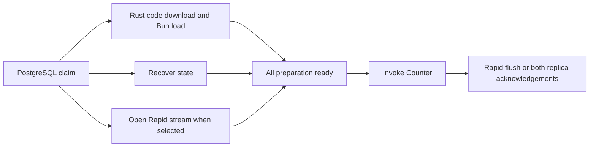

# Rust / GKE Sandbox latency experiment

September 28, 2026. **The experiment supports direct Rust code delivery and persistent Rapid streams.** With PostgreSQL ownership, the estimate is a returning write around **240–260 ms p50**, compared with **548 ms** in the saved Modal benchmark. Retaining GCS ownership instead models at **325–360 ms p50** before a planning allowance, depending on stream setup ordering. These are modeled client latencies using measured components, not production end-to-end measurements.

The full [architecture plan](gcs-rapid-kubernetes-plan.md) makes GKE Sandbox, Rust infrastructure, GCS ownership, direct streaming artifact downloads, and Rapid persistence the chosen production default, with configurable stronger durability and no added artifact-size caps. Retaining GCS ownership avoids introducing a PostgreSQL write-scaling and partitioning dependency; PostgreSQL remains a measured comparison, not a planned migration. The current decision is a breaking replacement: GKE Sandbox and Rapid are the production stack, without a selectable legacy Modal/state-snapshot backend or compatibility requirements. This report preserves the original experiment; its PostgreSQL and sandbox-replica scenarios are historical comparisons. The experiment did not change production services.

**Baseline recovered from Codex history**

Found the recent chats “Benchmark PR 101 with Modal and GCS” and “Benchmark PR 101 with Modal and GCS (2)” and reused their saved samples and critical-path traces. Measured revision `5658d00e80ed1e9b44a9b16283aded82164419c6`; the later sealed-hint correctness change was not rebenchmarked. The earlier test used ready Modal spares, Standard GCS and a Cloud Run control plane in us-west1, with this laptop as caller.

| Existing returning-write stage | p50 ms |
| --- | ---: |
| Laptop end to end | 548.0 |
| GCS owner lookup in control plane | 28.3 |
| Storage activation: checkpoint GET followed by owner CAS | 112.1 |
| Executor assignment to readiness, including mount/import/attach | 147.8 |
| First state commit | 153.7 |
| Combined uninstrumented HTTP/transport residual | 161.8 |

Storage activation and executor readiness overlap. Executor readiness finished last in 26/30 samples. The 148 ms is not an isolated filesystem-mount measurement, and removing an overlapping 64 ms owner CAS does not automatically save another 64 ms on the request. [Saved critical-path analysis](/Users/olimorissette/Desktop/projects/durable-objects/.artifacts/pr101-live/critical-path.md), [original report](/Users/olimorissette/Desktop/projects/durable-objects/.artifacts/pr101-live/report.md).

**What ran**

A temporary GKE Standard cluster used Google's managed GKE Sandbox runtime, one ordinary e2-standard-2 node and sandbox nodes in us-west4-a and us-west4-b. Rapid was verified as zonal storage in us-west4-a. Standard code storage was regional us-west4. GKE version: `1.35.8-gke.1225000`; Rust SDK: `google-cloud-storage 1.17.0`, with its bidirectional-write compile gate enabled. The measured image digest is `sha256:62d9e4e46f0c45db417fe40ffb4e34473893ee0706e25892ff17090007337b88`.

The candidate path is Rust throughout storage, direct code streaming, ownership calls, and replica servers. Bun executes the real SDK Counter worker. The 7,686-byte Counter bundle matches the earlier fixture's source; restored state is `{"count":41}`, and every invocation verifies the result and persisted state are 42. Separate persistence probes exercise 64-byte, 4 KiB, and 64 KiB payloads. These are experiment inputs, not product limits.

There were **1,160 measured samples per runtime**, plus warmups: 2,320 measured samples total across GKE Sandbox and the ordinary-Pod control. Combined scenarios have 30 measured samples per acknowledgement policy per runtime. Each scenario creates a fresh warmed JavaScript worker within the same test Pod; Pod creation, replica allocation, and connection warmup are outside this timing. No cross-tenant Pod reuse is proposed.

PostgreSQL 16 was an isolated instance on a 10 GiB SSD persistent disk, with `fsync`, `full_page_writes`, and `synchronous_commit` enabled. Each replica had its own 10 GiB zonal SSD persistent disk. Replica success required writing the temporary file, syncing it, renaming it, and syncing the containing directory. The two-zone path waited for both responses.

**Measured GKE Sandbox results**

All durations below are milliseconds. p50 uses the median; p95 uses nearest rank, matching the baseline report.

| Operation | p50 | p95 | Measured n |
| --- | ---: | ---: | ---: |
| PostgreSQL conditional owner claim | 1.6 | 2.6 | 100 |
| Code: Rust streaming download + install + Bun readiness | 37.4 | 55.7 | 30 |
| ↳ Download and write chunks locally | 28.7 | 36.7 | 30 |
| ↳ Bun import / registration | 7.2 | 14.8 | 30 |
| Rapid checkpoint read, new bidirectional descriptor | 28.2 | 40.0 | 100 |
| Rapid new object: open + 64-byte append + durable flush | 49.4 | 63.9 | 50 |
| Rapid reused stream, 64-byte durable flush | 2.7 | 4.1 | 100 |
| Rapid reused stream, 4 KiB durable flush | 2.3 | 3.2 | 100 |
| Rapid reused stream, 64 KiB durable flush | 3.0 | 3.8 | 100 |
| Standard GCS new object, 4 KiB | 54.0 | 74.6 | 50 |
| One durable same-zone replica, 4 KiB | 6.2 | 8.6 | 100 |
| Both durable replicas in two zones, 4 KiB | 6.9 | 8.4 | 100 |
| Combined activation + invocation + Rapid acknowledgement | 52.5 | 78.6 | 30 |
| Combined activation + invocation + both replica acknowledgements | 50.7 | 63.5 | 30 |

The combined path executes:

In the zonal scenario, stream opening took **34.2 ms p50**, overlapping code readiness (**37.4 ms**) and recovery (**23.8 ms**). The resulting first commit, after opening the stream during preparation, took **5.9 ms p50**. The whole internal scenario took **52.5 ms**. The two-replica variant took **50.7 ms**; that small difference does not establish that stronger durability is faster. Its replicas were already ready and it did not open a Rapid writer in preparation.

The ordinary-Pod control measured **45.5 ms** for the zonal scenario versus **52.5 ms** under GKE Sandbox. The roughly 7 ms difference includes runtime and placement effects: the ordinary Pod shared a node with PostgreSQL. It is not a clean isolation of gVisor overhead.

**Estimated user-visible improvement**

| Change | Estimated returning-write p50 | Interpretation |
| --- | ---: | --- |
| Current saved baseline | 548 ms, measured | Existing Modal path |
| PostgreSQL ownership alone | 513 ms | About 35 ms saved; code readiness still dominates |
| Direct Rust code delivery alone | 507 ms | Storage activation becomes the longer branch |
| Code delivery + PostgreSQL ownership | 408 ms | Still retains the old snapshot and commit paths |
| Full measured candidate, Rapid acknowledgement | 241 ms | About 307 ms saved; modeled |
| Full candidate + 20 ms planning allowance | 261 ms | Illustrative allowance for omitted integration work, not a confidence interval |

For each of the 30 matched old traces, the combined model subtracts its owner lookup, the **maximum** of its two activation branches, actor execution, and commit; then inserts the new measured internal scenario median. Existing deployment lookup, spare-claim overhead, post-readiness work, and the entire old transport residual remain. It does not sum unrelated stage medians or remove both overlapping branches independently.

For hot actors, the existing laptop benchmark measured **37.6 ms p50 reads** and **117.2 ms p50 writes**. A hot read uses resident state and does not need code download, PostgreSQL ownership acquisition, or GCS. With the same network/routing overhead, **about 35–40 ms p50** is the current read estimate; no full new-path hot-read benchmark was run. Warm-write modeling gives approximately **75 ms p50** with a Rapid flush, or **79 ms** with both replica acknowledgements. These retain the old client/transport costs. The saved hot-write traces contain **70.7 ms p50 of client-minus-host residual**, compared with **35.9 ms for hot reads**. The model conservatively preserves that difference; it does not establish that the new system intrinsically needs that much extra write overhead. The next integrated hot-path benchmark should explain or remove it. Routing through an internal GKE gateway may improve those costs further, but that benefit was not measured or credited. [Paired baseline traces](/Users/olimorissette/Desktop/projects/durable-objects/.artifacts/rapid-gke-20260928/results/baseline-paired.json), [model output](/Users/olimorissette/Desktop/projects/durable-objects/.artifacts/rapid-gke-20260928/results/model.json), [analysis script](/Users/olimorissette/Desktop/projects/durable-objects/.artifacts/rapid-gke-20260928/analyze.py).

The model is a planning estimate. The new test region is us-west4 because Rapid is supported there; the baseline was us-west1. It is sequential, low-load, and uses the small Counter fixture. It omits production replica-membership setup, full fencing/recovery protocol, authentication/gateway integration, and HA PostgreSQL. The two-zone scenario measures durable replica acknowledgements; its restored checkpoint still comes from Rapid, so it is not a test of regional failover or a complete regional-durability implementation. Reported model tail values are synthetic and are not production p95 forecasts.

**Keeping GCS ownership**

GCS ownership can remain in regional Standard GCS while actor mutations use Rapid. Its existing generation-conditional writes remain the authority mechanism; Rapid append acknowledgements do not replace those ownership checks. Google documents generation-match preconditions for conditional updates. [GCS preconditions](https://docs.cloud.google.com/storage/docs/request-preconditions)

| Returning write after the other architecture changes | Modeled client p50 |
| --- | ---: |
| PostgreSQL ownership | 242 ms |
| GCS ownership, speculative Rapid stream setup overlaps recovery and claim | 325 ms |
| GCS ownership, Rapid stream opens only after the ownership claim | 359 ms |

This comparison combines each of the 30 old traces with each of the 30 zonal candidate traces. It replaces the measured PostgreSQL claim with the old GCS owner lookup, then changes readiness to `max(code, recovery + owner CAS + stream open)` for the conservative variant. Speculative setup instead uses `max(code, recovery + owner CAS, stream open)`. These are 900 synthetic combinations, not 900 independent measurements. All other modeled stages remain the same. The incremental penalty from retaining GCS is approximately **81–115 ms p50**. Unlike the earlier 240–260 ms range, these table values contain no arbitrary 20 ms planning allowance. [Comparison output](/Users/olimorissette/Desktop/projects/durable-objects/.artifacts/rapid-gke-20260928/results/ownership-comparison.json)

The saved owner lookup and conditional write cost about 28 ms and 64 ms respectively. In the old architecture, much of that write overlapped the roughly 148 ms executor branch, so PostgreSQL alone saved only about 35 ms. Direct code delivery makes the executor ready in roughly 37 ms, exposing more of the ownership write. The lower GCS estimate additionally assumes a uniquely named, isolated stream can be opened before the claim; it must never execute the actor or publish committed state unless the claim succeeds. Losing claims discard that speculative stream.

Normal hot calls keep their current estimates with either ownership backend: approximately 35–40 ms reads and 75 ms Rapid writes from the laptop. The host checks its local lease fence, and renewal runs in the background. Recovery, renewal failure, and ownership contention are different paths. This GCS-plus-Rapid hybrid has not been run in the cloud; the GCS timings come from the old region and the PostgreSQL timings from a single-instance test, not HA Cloud SQL. The next integrated benchmark should measure the selected GCS-ownership architecture in GKE.

**Rust SDK findings**

The official Rust SDK successfully created appendable Rapid objects, flushed verified persisted offsets, and read the data back under GKE Sandbox. Keeping the stream open matters: **49.4 ms** for a new 64-byte object versus **2.7 ms** for another flush on an existing stream. Use append streams for repeated mutations and overlap opening with activation.

An initial diagnostic using ordinary `read_object` against an unfinalized Rapid object repeatedly took approximately five seconds. The measured candidate instead uses `open_object().send_and_read()` with the known persisted range; its reads took **28.2 ms p50** including a new descriptor. The diagnostic rows are excluded from all candidate summaries. This experiment does not establish the precise server-side cause of the slow ordinary reads.

The observed Rust connections used public Google storage endpoints; the experiment did not establish ALTS/DirectPath connectivity. The measured Rust flushes were low milliseconds, not submillisecond. Google's documented DirectPath support and its advertised latency should not be assumed for this Rust setup. [Direct connectivity requirements](https://docs.cloud.google.com/storage/docs/direct-connectivity), [Rapid object operations](https://docs.cloud.google.com/storage/docs/rapid/use-objects-in-zonal-buckets).

**Lifecycle and recovery checks**

Three fresh GKE Sandbox Pods on existing nodes with the image cached were observed Kubernetes-Ready in **3.3–4.6 seconds** and completed the worker-warming request in **3.8–5.0 seconds**. These three lifecycle smoke samples are background pool-replenishment timings, not prewarmed actor activation latency or an isolated measurement of gVisor startup.

Audit of `lifecycle.py`, `deploy.py`, and `src/worker.mjs` shows what the timer includes: the laptop submits a new Pod with two containers (an idle benchmark driver and a Bun worker server), waits for a Kubernetes readiness probe configured with a 2-second period while polling Pod status at 250 ms intervals, and then sends `/prepare` through the Kubernetes API-server Pod proxy. That final call creates and warms the actual `ActorWorker` and adds 403–477 ms to the observation. Its duration combines proxy/network transit and worker warming; the harness did not isolate their contributions. The `http_ready_ms` field names the time the laptop observed Kubernetes Ready, not the instant the server first accepted HTTP. Probe scheduling, API status propagation, fresh client connections, and polling affect the measurement. No stage timestamps establish the exact gVisor runtime cost, and there is no equivalent fresh ordinary-Pod control for this lifecycle probe. The actor Pod uses `emptyDir`, so Persistent Disk attachment is not an explanation for these samples.

Google documents [sub-second warm-pool allocation](https://docs.cloud.google.com/kubernetes-engine/docs/concepts/machine-learning/agent-sandbox) and [reports 90% of allocations within 200 ms at 300 allocations/second per cluster](https://cloud.google.com/blog/products/containers-kubernetes/bringing-you-agent-sandbox-on-gke-and-agent-substrate). Those are provider allocation figures, not a measured Terse first-write latency or SLA. Google's [production routing guidance](https://docs.cloud.google.com/kubernetes-engine/docs/how-to/agent-sandbox#run-sandboxes-in-production) uses an in-cluster router connection or Gateway, avoiding the development tunnel path. Our next activation benchmark must allocate a fully initialized spare through the in-cluster control plane, with Bun and host clients already warm, and separately timestamp claim, assignment, code load, ownership/recovery, first execution, and durable acknowledgement. Background Pod creation must remain outside that request timer.

The 325–360 ms GCS-ownership first-write forecast also preserves about 189 ms p50 of residual work from the old deployment after subtracting the explicitly replaced stages. This includes old routing, control-plane, and bookkeeping costs; it is not a measured GKE activation floor. The integrated benchmark must replace that residual with observations of the new gateway and control plane.

All successful sample assertions passed: actor result/state, Rapid persisted offsets and byte-for-byte readbacks, live-lease rejection, and replica readbacks. The ownership probe also submitted two claims over one database connection and verified only one succeeded; this is not a distributed contention test. After deleting replica B, replica A still held `{"count":42}`; recreating B against its persistent disk restored the same state. This proves persistence across that Pod replacement, not zone-failure recovery. Five analysis tests verify overlap accounting, including the retained-GCS variants.

**Recommendation**

The subsequent [two-zone](gcs-rapid-multizone-benchmark.md) and [cross-region](gcs-rapid-crossregion-benchmark.md) experiments support one Rapid persistence implementation for all durability policies. Use **a persistent Rust Rapid stream for the lowest-latency zonal default** and concurrent flushes to every required Rapid bucket for stronger policies. The delivered architecture replaces the old Modal/Go stack, sandbox storage replicas, and Standard GCS state-snapshot backend. Backward compatibility and migration tooling are outside the implementation scope. Ownership, code availability, epoch fencing, membership, and recovery must also satisfy the selected policy. See the [current latency forecast and plan](gcs-rapid-kubernetes-plan.md) for the combined interpretation; the original sandbox-replica model above is retained only as experimental evidence.

Keep GCS ownership as the intended architecture. Accept the modeled 80–115 ms activation penalty in exchange for avoiding an ownership database that must be partitioned as write load grows. Separate metadata storage from actor-state persistence and adapt recovery references and fencing to Rapid segments. The isolated PostgreSQL result establishes low-load claim latency, not fleet-scale or HA capacity. Cross-region durability still needs an explicit solution for ownership outside a failed region.

The current 10-second renewal interval means one million active actors would generate roughly 100,000 periodic ownership writes per second, plus the same number of reads under the existing renewal protocol, before other ownership traffic. This is an illustrative load calculation, not a benchmark result. PostgreSQL read replicas cannot absorb these writes. GCS automatically distributes aggregate load across objects, subject to scaling time and key distribution. The one-write-per-second limit on an individual Standard GCS object still matters for rapid ownership churn. The next integrated GCS-plus-Rapid benchmark must cover both fleet-wide renewal load and repeated claims/renewals on one actor, including throttling, tail latency, and operation cost. [Cloud SQL replication](https://docs.cloud.google.com/sql/docs/postgres/replication), [GCS request scaling](https://docs.cloud.google.com/storage/docs/request-rate), [GCS object limits](https://docs.cloud.google.com/storage/quotas).

**Artifacts and cleanup**

[Benchmark source and procedure](/Users/olimorissette/Desktop/projects/durable-objects/.artifacts/rapid-gke-20260928/README.md), [GKE Sandbox samples](/Users/olimorissette/Desktop/projects/durable-objects/.artifacts/rapid-gke-20260928/results/gvisor-samples.jsonl), [ordinary-Pod samples](/Users/olimorissette/Desktop/projects/durable-objects/.artifacts/rapid-gke-20260928/results/regular-samples.jsonl), [statistics](/Users/olimorissette/Desktop/projects/durable-objects/.artifacts/rapid-gke-20260928/results/summary.json), [validation](/Users/olimorissette/Desktop/projects/durable-objects/.artifacts/rapid-gke-20260928/results/validation.json), [lifecycle samples](/Users/olimorissette/Desktop/projects/durable-objects/.artifacts/rapid-gke-20260928/results/lifecycle.jsonl). Raw diagnostic attempts are retained separately for auditability.

**Cleanup verified complete:** temporary cluster, nodes, persistent disks, firewall rules, buckets, images, service account, and IAM grants are absent. Uploaded build-source archives and the generated default kubeconfig entries were also removed. Build records and local experiment artifacts remain for auditability. [Cleanup audit](/Users/olimorissette/Desktop/projects/durable-objects/.artifacts/rapid-gke-20260928/cleanup-audit.json). Production services and databases were not modified.
